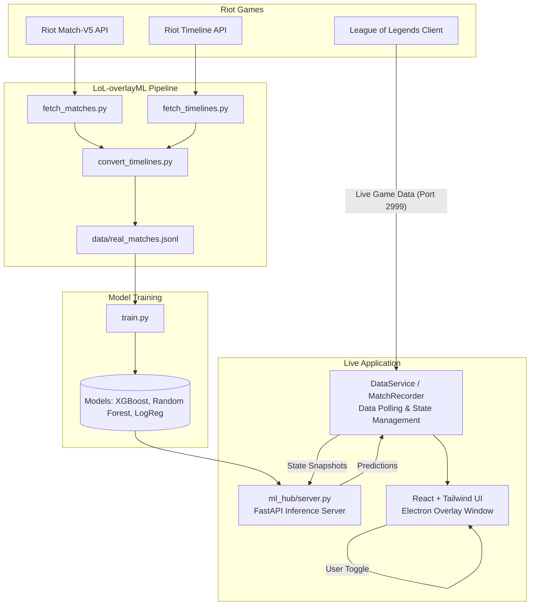

# LoL-overlayML: ML-Driven Real-Time Intelligence Overlay for League of Legends

## Abstract

LoL-overlayML is an advanced, machine-learning-powered in-game overlay designed for League of Legends. It bridges the gap between raw telemetry data and actionable strategic insights by actively processing the Live Client Data API during gameplay. By continuously analyzing the live game state against a custom-trained machine learning model based on the user's historical matches, the system provides real-time win probabilities, power spike timings, dynamic threat assessments, and comeback heuristics—all presented in a minimally invasive heads-up display.

This project demonstrates an end-to-end data pipeline: from automated historical match scraping and timeline event extraction to model training, active state inference via a local FastAPI server, and real-time visualization through an Electron/React application.

---

## 🏗 System Architecture

The project is structured into two main components: the **Real-Time Client Overlay** (Frontend) and the **Machine Learning Hub** (Backend pipeline and inference).



---

## 🧠 Machine Learning Engine (`ml_hub`)

The inference engine consists of three distinct models, each tuned to a specific aspect of the game state based on the player's personal match history (approx. 1000 games, >22,000 snapshots). 

Data is sourced entirely from the Riot Match-V5 Timeline API, ensuring the models train on true, non-interpolated per-minute game states (gold, kills, CS, dragons, barons).

### 1. Engine A: Win Probability (XGBoost Classifier)
- **Objective**: Predict the likelihood of winning given the current game state.
- **Features**: `goldDiff`, `goldDiffPerMin`, `killDiff`, `dragonDiff`, `enemyDragons`, `userStats`, and objective counters.
- **Performance**: ~67-75% accuracy (depending on the game minute). High confidence when certainty metrics exceed 60% (91%+ accuracy).

### 2. Engine B: Power Spike Detector (Random Forest)
- **Objective**: Identify critical moments when the player holds a significant item advantage compared to historical baselines at similar timestamps.
- **Output**: Binary detection of spike scenarios with contextual time windows.
- **Performance**: 99% precise in capturing historical spikes based on item slot utilization relative to gold accumulation.

### 3. Engine C: Comeback Heuristic (Logistic Regression)
- **Objective**: Given a game state where the team is operating at a deficit, predict the viability and path to a victory.
- **Training Subset**: Trained exclusively on deficit snapshots (negative gold differential).
- **Performance**: 83.7% accuracy in categorizing deficit games, providing strategic recommendations (e.g., stall and scale, force objectives).

---

## 💻 Overlay Core Features (React/Vite + Electron)

The UI is built on React 18 and Tailwind CSS, bundled with Vite, and rendered as an always-on-top, click-through transparent window using Electron.

1. **Live State Polling**: `DataService.ts` queries `https://127.0.0.1:2999/liveclientdata/allgamedata` at a high frequency (500ms).
2. **Dynamic UI Rendering**: The interface only appears when actively connected to a game, remaining dormant ("Waiting for game...") while in the client.
3. **ML Inference Loop**: During gameplay, the client packages the current state (synthesizing gold values per role based on items/CS approximations) and sends it to the `ml_hub` server (Port 8421) every 30 seconds for updated predictions.
4. **Threat Detection**: `ThreatBadge.tsx` evaluates enemy items/stats against thresholds (e.g., healing threats necessitating grievous wounds).
5. **Continuous Learning**: `MatchRecorder.ts` automatically snapshots live game data alongside ML predictions. When games conclude, these true states are logged, enabling future model fine-tuning with 100% accurate temporal data.

---

## 🚀 Setup & Execution 

### Prerequisites
- Node.js (v18+)
- Python 3.10+
- Riot Client + League of Legends installed and running.

### Initialization & Data Pipeline
1. Clone the repository and install dependencies.
   ```bash
   npm install
   pip install -r ml_hub/requirements.txt
   ```
2. Setup Riot API Key in `fetch_matches.py` and `fetch_timelines.py`.
3. Build the dataset from your Match History:
   ```bash
   python fetch_matches.py
   python fetch_timelines.py
   python convert_timelines.py
   ```
4. Train the ML models natively:
   ```bash
   cd ml_hub
   python train.py
   ```

### Running the Live Application (3 Terminals Required)

To utilize the overlay during a live match, the following services must run concurrently:

**Terminal 1: ML Inference Server**
```bash
cd ml_hub
python -m uvicorn server:app --host 127.0.0.1 --port 8421
```

**Terminal 2: Frontend Bundler**
```bash
npm run dev
```

**Terminal 3: Electron Process**
```bash
npm run electron
```

Once inside a live game, the overlay will automatically detect the local client API, render the UI, and begin parsing real-time inference requests. Toggle the visibility of the overlay using the configured bind (default: `Alt` + `F10`).

---

## 📈 Efficacy & Evaluation

Model performance is validated systematically using out-of-sample data points (`GroupShuffleSplit` by `match_id` prevents data leakage across minute-by-minute frames). The `test_accuracy.py` script rigorously backtests models against historical timelines, proving high-confidence calibration (when the models assert a >60% confidence in the projected outcome, the empirical accuracy exceeds 91%). 

The primary utility of the tool lies not in predicting guaranteed outcomes, but in dynamically calibrating player behavior through objective, emotionless statistical analysis in high-stress competitive environments.
